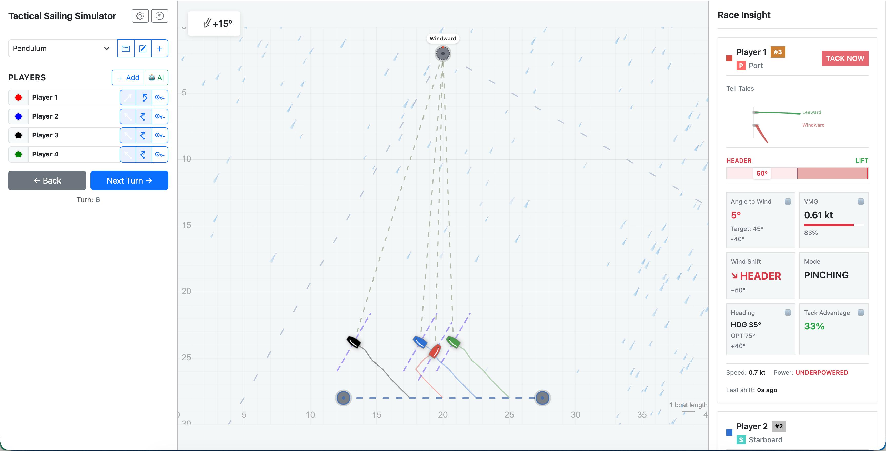

# Tactical Sailing Simulator (TSS)

<div align="center">
  
  
  **A tactical sailing race simulator built with modern web technologies**
  
  [](https://www.typescriptlang.org/)
  [](https://kit.svelte.dev/)
  [](LICENSE)
</div>

## Overview

TSS is a sophisticated sailing race simulator that combines realistic wind dynamics, tactical decision-making, and AI opponents. Built with **Clean Architecture** and **Domain-Driven Design** principles, it provides both an engaging gameplay experience and a well-structured codebase for developers.

**Version 1.4.0** - Major component refactoring milestone with improved code organization and maintainability.

## Quick Start

### For Players

New to TSS? Check out the **[Quick Start Guide](./QUICKSTART.md)** to learn how to play your first race!

### For Developers

```bash
# Install dependencies
npm install

# Start development server
npm run dev

# Build for production
npm run build

# Preview production build
npm run preview
```

The application will be available at `http://localhost:5173`

## Features

### Gameplay
- 🎮 **Full tactical sailing race simulation** with realistic wind dynamics
- ⛵ **Player management** with customizable start positions and boat colors
- 🤖 **AI players** with three difficulty levels (Easy, Medium, Hard)
- 🌬️ **Wind scenario system** with presets and custom scenarios
- 📊 **Visual game canvas** with tactical grid, laylines, and boat tracks
- 📈 **Tactical metrics** including VMG, Angle to Wind, Tack Advantage, and more
- 🎨 **Modern UI** with responsive layout and intuitive controls

### Technical
- 🏗️ **Clean Architecture** with clear separation of concerns
- 🔧 **TypeScript** for type safety throughout
- 📦 **Domain-Driven Design** with rich domain model
- 🧪 **Well-tested** architecture ready for testing
- 📝 **Comprehensive documentation** for developers and players
- 🔍 **Error tracking** ready (Sentry integration)

## Architecture

The project follows **Clean Architecture** with four distinct layers:

```
┌─────────────────────────────────────┐
│   Presentation Layer (UI)            │  ← Svelte components, hooks
├─────────────────────────────────────┤
│   Application Layer                 │  ← Use cases, services, DTOs
├─────────────────────────────────────┤
│   Domain Layer                      │  ← Entities, value objects, domain services
├─────────────────────────────────────┤
│   Infrastructure Layer              │  ← Logging, error handling, stores
└─────────────────────────────────────┘
```

### Key Layers

- **Domain Layer**: Core business logic (entities, value objects, domain services, events)
- **Application Layer**: Use cases and orchestration (services, DTOs, mappers)
- **Infrastructure Layer**: Technical implementations (logging, error handling, stores)
- **Presentation Layer**: UI components and user interaction (Svelte components, hooks)

See [ARCHITECTURE.md](./docs/ARCHITECTURE.md) for detailed architecture documentation.

## Project Structure

```
tss/
├── src/
│   ├── lib/
│   │   ├── domain/          # Domain Layer (business logic)
│   │   ├── application/     # Application Layer (use cases, services)
│   │   ├── presentation/     # Presentation Layer (UI components)
│   │   └── infrastructure/   # Infrastructure Layer (logging, errors)
│   └── routes/               # SvelteKit routes
├── static/                   # Static assets
├── docs/                     # Documentation
└── package.json              # Dependencies
```

## Documentation

### For Players
- **[Quick Start Guide](./QUICKSTART.md)** - Get started playing your first race
- **[Race Insights Guide](./docs/RACE_INSIGHTS.md)** - Understand all tactical metrics and indicators

### For Developers
- **[Architecture Overview](./docs/ARCHITECTURE.md)** - Complete architecture documentation
- **[Development Guide](./docs/DEVELOPMENT.md)** - Developer guide and workflow
- **[Contributing Guidelines](./docs/CONTRIBUTING.md)** - How to contribute
- **[Architecture Decision Records](./docs/ADRs/)** - ADRs for key architectural decisions
- **[Project Structure](./docs/PROJECT_STRUCTURE.md)** - Detailed project structure

### Other
- **[Product Backlog](./BACKLOG.md)** - Upcoming features and improvements
- **[Release Notes](./docs/RELEASE_NOTES.md)** - Version history and release notes

## Technology Stack

- **Framework**: [SvelteKit](https://kit.svelte.dev/) - Modern web framework
- **Language**: [TypeScript](https://www.typescriptlang.org/) - Type safety
- **Architecture**: Clean Architecture + Domain-Driven Design
- **Error Tracking**: [Sentry](https://sentry.io/) (optional)

## Development

### Prerequisites

- Node.js 18+ and npm 9+
- Git

### Available Scripts

```bash
npm run dev          # Start dev server
npm run build        # Build for production
npm run preview      # Preview production build
npm run lint         # Run ESLint
npm run lint:fix     # Fix linting issues
npm run check        # Type check with svelte-check
npm run format       # Format code with Prettier
npm run validate     # Run lint, format check, and type check
```

### Code Quality

The project uses:
- **ESLint** for code linting
- **Prettier** for code formatting
- **TypeScript** for type checking
- **Husky** for git hooks
- **lint-staged** for pre-commit checks

## Contributing

We welcome contributions! Please see [CONTRIBUTING.md](./docs/CONTRIBUTING.md) for guidelines.

## License

MIT License - see LICENSE file for details

---

<div align="center">
  Built with ❤️ using [SvelteKit](https://kit.svelte.dev/) and [TypeScript](https://www.typescriptlang.org/)
</div>
